# IMM baseline clustering (PCA + GMM, k = 5)

YTC041_1, 24 IMM surfaces, `sigma5` features.

## Results

- **k = 5 is the only stable solution:** ARI 0.95 across 5 seeds, against 0.64–0.84 for every other k from 3 to 10.
- **Clusters aren't surfaces:** each cluster draws on 21–23 of the 24 surfaces (AMI 0.02).
- **Clusters form patches on the mesh:** mesh coherence is 0.96, against 0.74 for a smoothing-only null, and it's above the null on all 24 surfaces.
- **Two groups:** 55% of vertices sit about 13 nm from the OMM (c0, c4) and 45% about 80 nm away (c1, c2, c3).

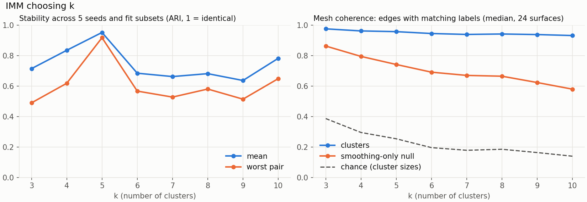

## Clusters

| Cluster | Colour | Share | Distance to OMM | Nearest other IMM | Shape index | Curvedness |
|---|---|---|---|---|---|---|
| c0 | blue | 35% | 13 nm | 249 nm | −0.27 | 0.007 |
| c4 | pink | 19% | 13 nm | 258 nm | −0.05 | 0.010 |
| c2 | green | 22% | 81 nm | 33 nm | −0.37 | 0.015 |
| c1 | orange | 12% | 83 nm | 97 nm | −0.53 | 0.021 |
| c3 | yellow | 11% | 78 nm | 46 nm | −0.27 | 0.025 |

c1 and c2 are separated mainly by whether the face's normal ray hits another membrane (96% accuracy with that feature alone), not by shape.

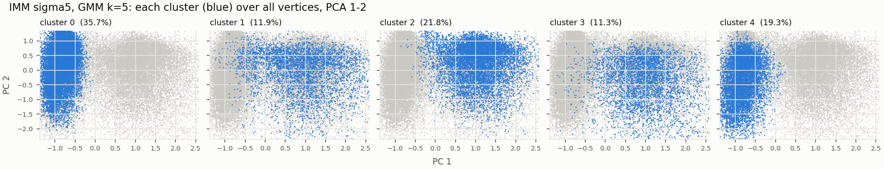

## On the mesh

Per surface: an overview from above, then a close-up of the clusters inside.

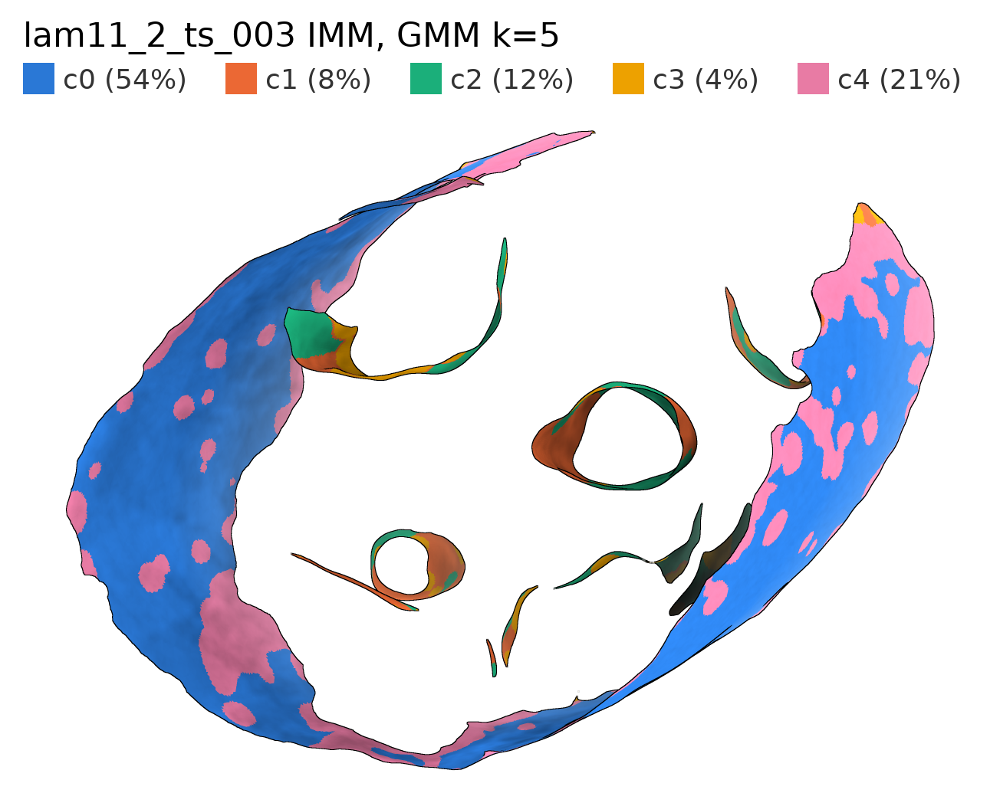
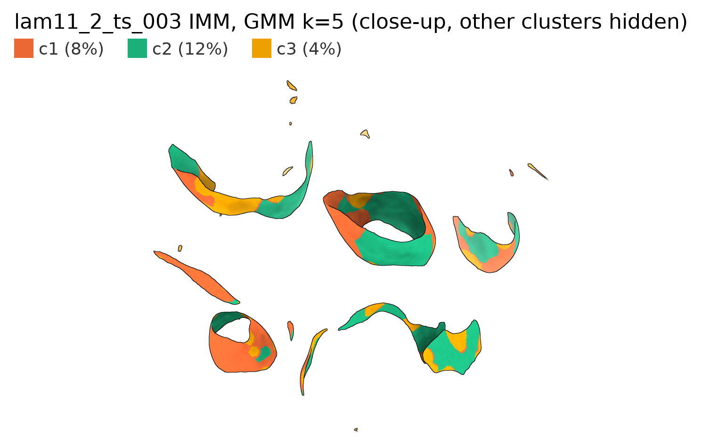
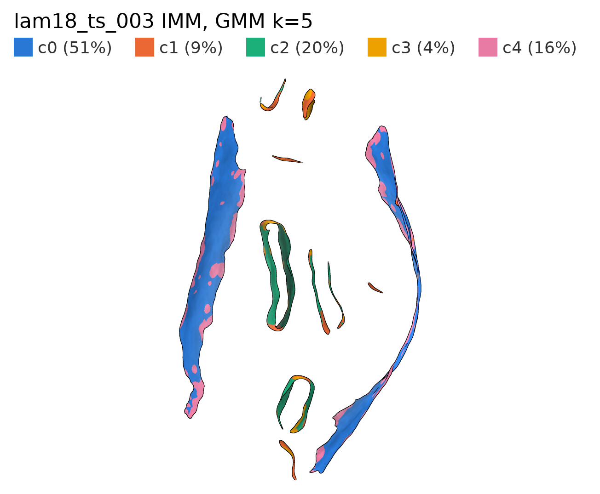
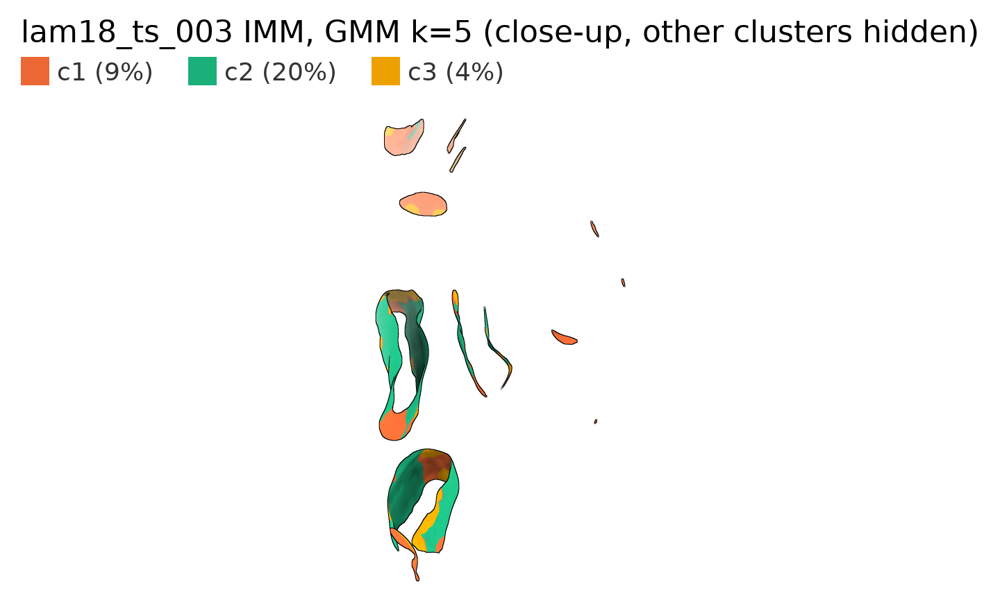
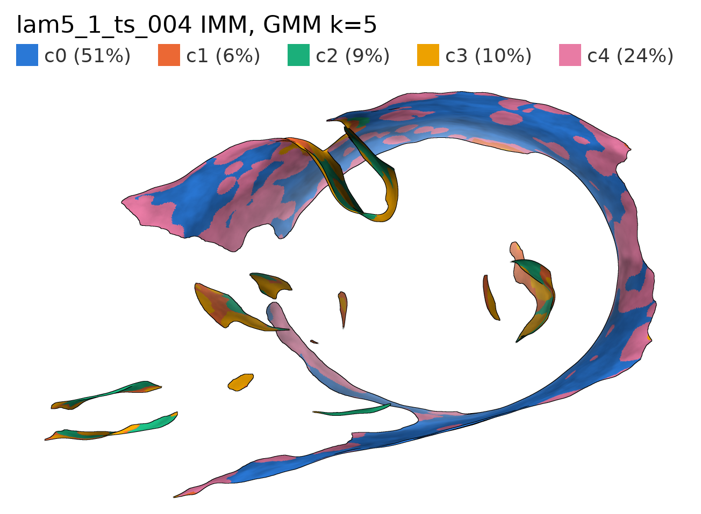
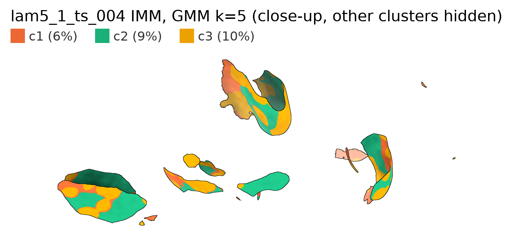

## c3

c3 sits at crista edges and tips next to open mesh edges, not at crista junctions.

| Over 24 surfaces | c3 | c1 | c2 |
|---|---|---|---|
| Median mesh steps to c0/c4 | 41 | 19 | 45 |
| Median mesh steps to an open mesh edge | 5 | 7 | 10 |
| Within 5 steps of an open mesh edge | 54% | 42% | 28% |

Only 11% of c3's separate patches touch c0/c4. Open mesh edges are mostly where the segmentation cuts a crista off, so part of c3 is likely less reliable estimates at those edges.

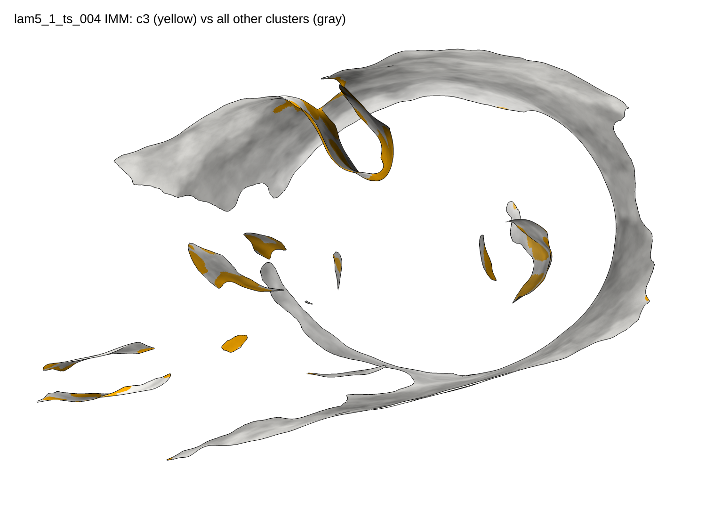

## Smoothing (sigma 0, 2, 5)

Stability ARI (mean / worst) by k:

| k | sigma 0 | sigma 2 | sigma 5 |
|---|---|---|---|
| 4 | 0.74 / 0.60 | 0.90 / 0.84 | 0.84 / 0.62 |
| **5** | **0.95 / 0.92** | **0.91 / 0.78** | **0.95 / 0.92** |
| 6 | 0.90 / 0.84 | 0.74 / 0.44 | 0.69 / 0.57 |
| 7 | 0.92 / 0.86 | 0.73 / 0.50 | 0.66 / 0.53 |

- **k = 5 is the most stable at every sigma,** but k = 4 (sigma 2) and k = 6–7 (sigma 0) come close.
- **Clusters form patches even without smoothing:** mesh coherence is 0.945 at sigma 0, against 0.27 chance.
- **Only the two-group split carries over between sigmas:** ARI against sigma 5 is 0.87 at sigma 2 and 0.83 at sigma 0. The five clusters themselves don't: ARI 0.60 at sigma 2 and 0.32 at sigma 0.
- **The subclusters partly follow `self_dist_min_valid`.** At sigma 0 the flag is binary and the near-OMM group splits exactly on it. Smoothing blends the flag, and that changes where the subclusters split.

## Without the ray-hit features

Refit with the `_valid` flags removed ("no flags"), and with the flags plus `self_dist_min/far` removed ("geometry"). Those two self-distances still say whether a normal ray hit another membrane.

| Features | Most stable k (ARI mean / worst), sigma 0 | sigma 2 | sigma 5 |
|---|---|---|---|
| All | 5 (0.95 / 0.92) | 5 (0.91 / 0.78) | 5 (0.95 / 0.92) |
| No flags | 7 (0.90 / 0.81) | 5 (0.97 / 0.94) | 4 (0.90 / 0.81) |
| Geometry | 7 (0.83 / 0.74) | 9 (0.84 / 0.77) | 4 (0.94 / 0.89) |

- **The two groups survive.** Clusters still stay inside one group: 94–97% of rows (geometry) and 94–99.7% (no flags) fall in a cluster whose majority group is their own.
- **k = 5 doesn't.** Without the ray-hit features, the most stable k differs at each sigma, so the stable k = 5 came largely from those features.
- **Geometry-only subclusters don't agree across sigma either:** at k = 4, ARI is 0.84 between sigma 2 and 5, but 0.34–0.35 against sigma 0.

## UMAP + HDBSCAN comparison

Same pooled matrix, 100k rows, UMAP 2D (no PCA), HDBSCAN `min_cluster_size=1000`.

- **3 clusters, 0.1% noise.** HDBSCAN finds the two groups: its clusters 0 and 2 match GMM (c0+c4) vs (c1+c2+c3) with ARI 0.93.
- **It doesn't split either group further.** ARI against GMM k = 5 is 0.45. In the UMAP, c1/c2/c3 and c0/c4 form continuous regions with no gap for HDBSCAN to cut along.
- **Its third cluster (1.4%) depends on surface:** 27% of it comes from one surface, and it draws on only about 8 effective surfaces.

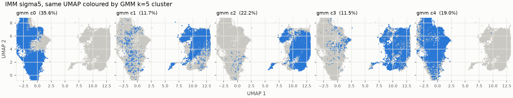

On the mesh, each triangle gets the label of its 15 nearest embedded rows.

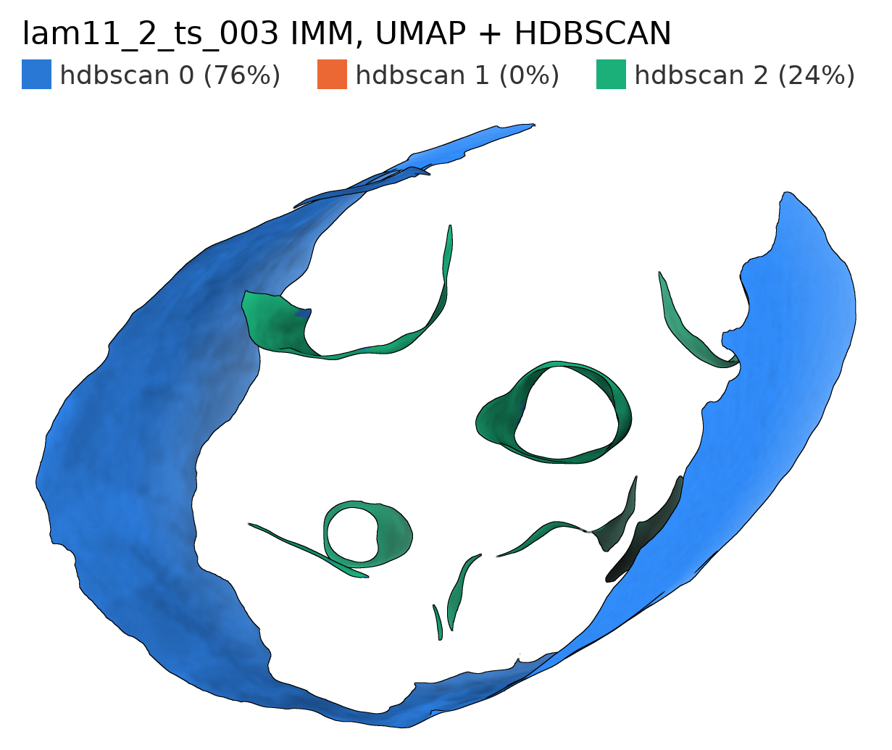
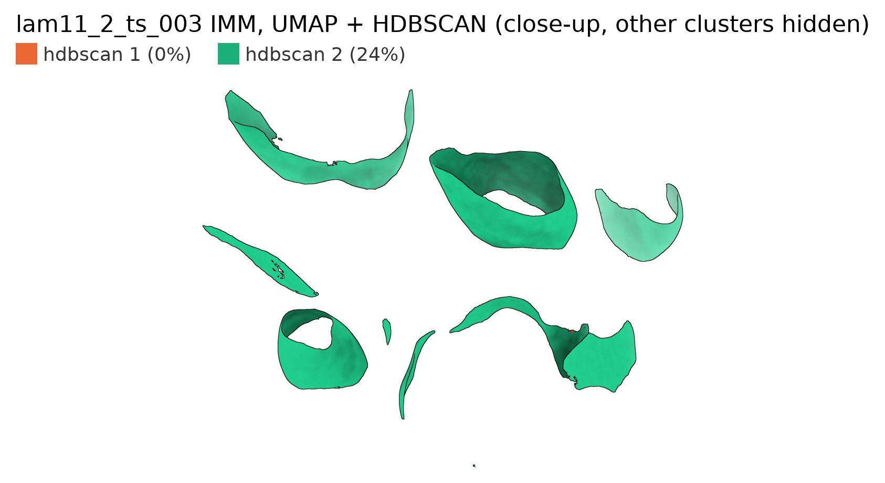
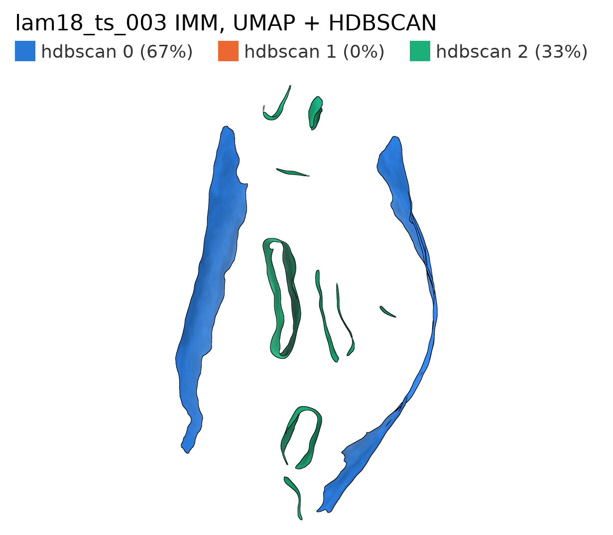
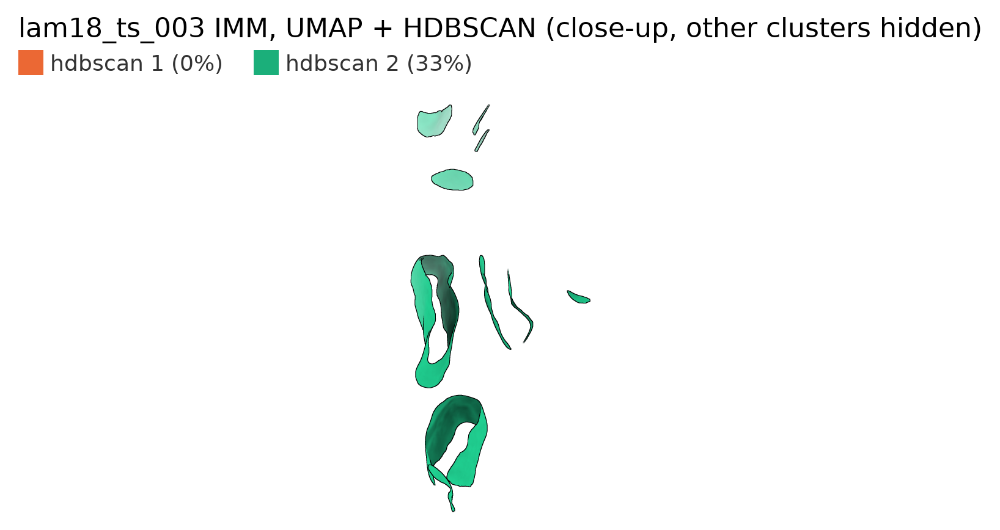
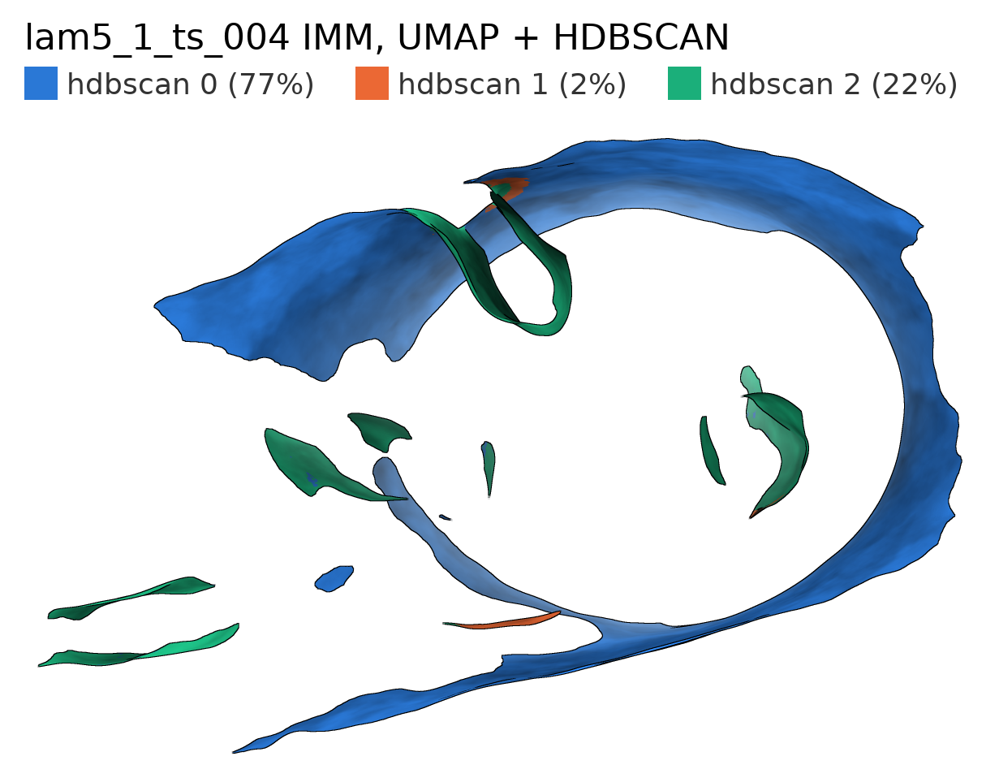
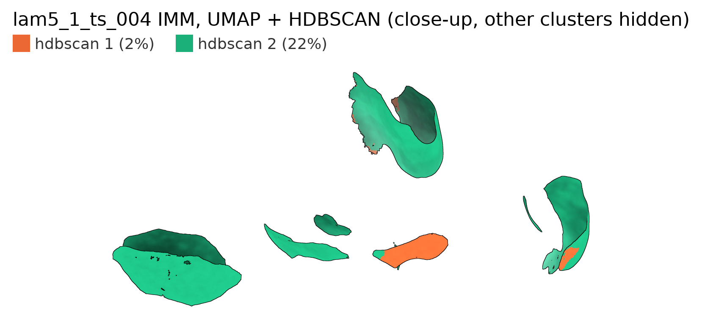

## Caveats

- IMM only.
- Only the two-group split is robust. Subclusters change with smoothing and with whether the ray-hit features are included.

## Next

1. Repeat for OMM.
