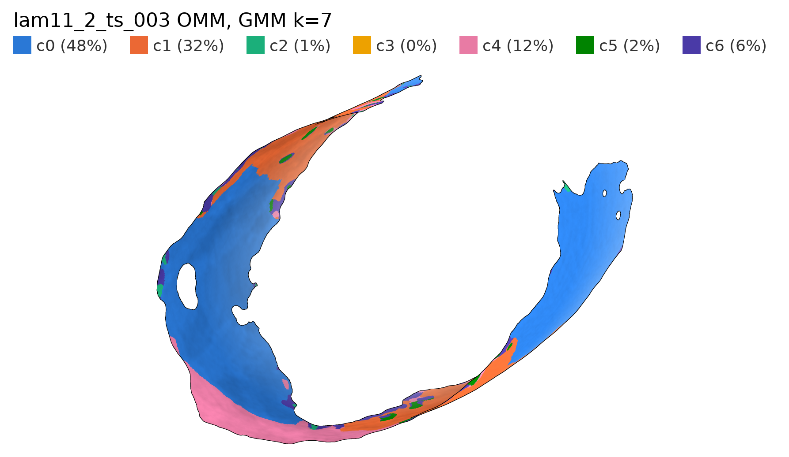
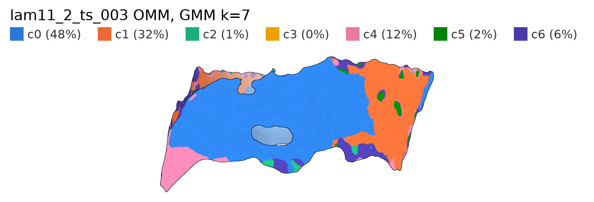
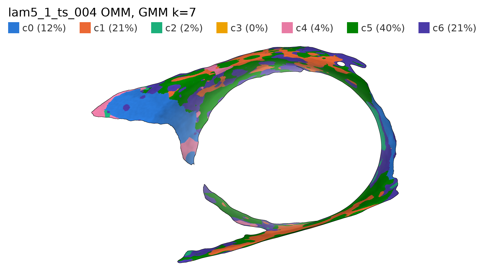
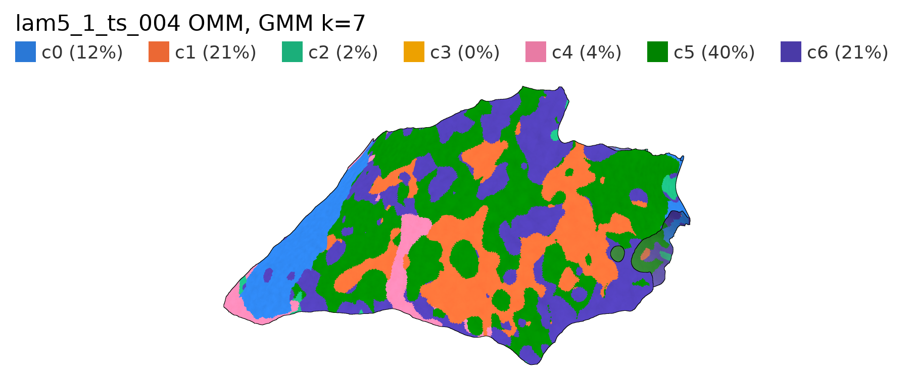
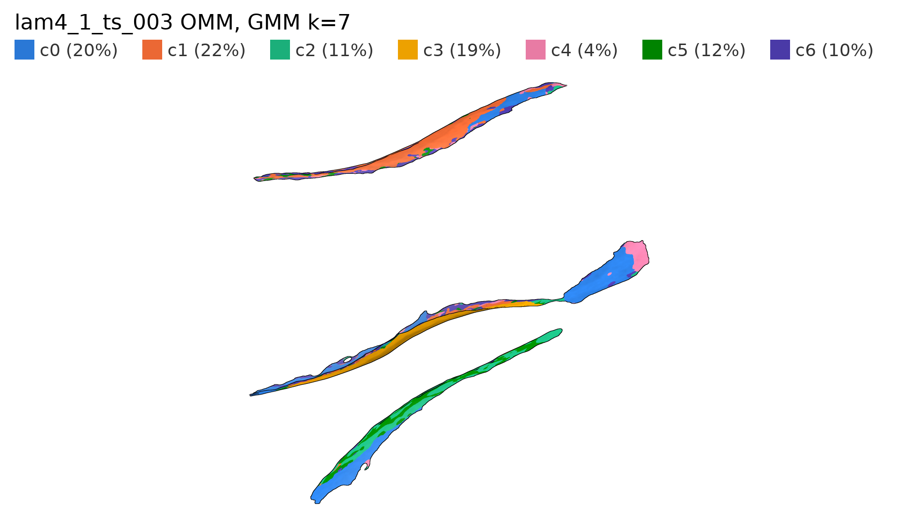
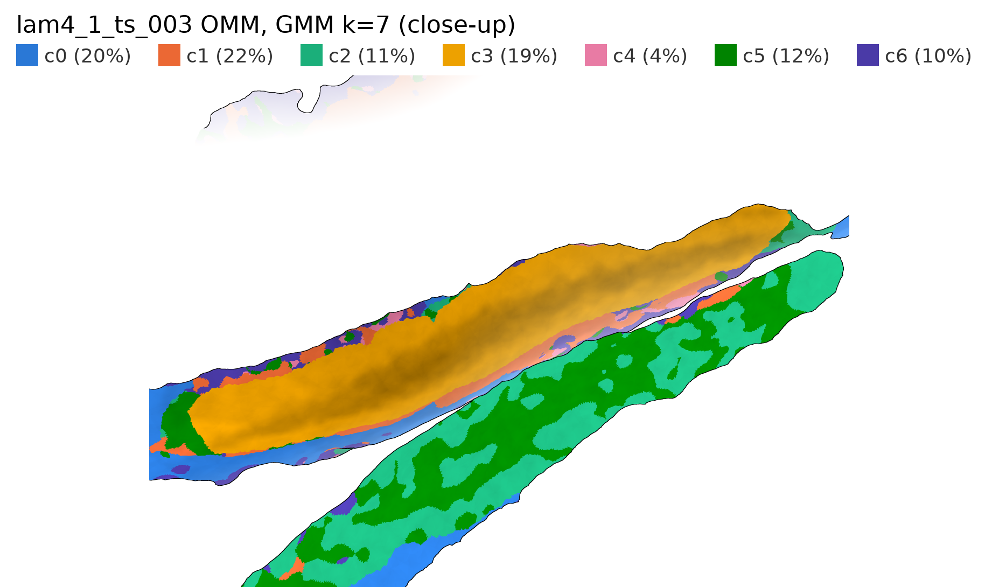
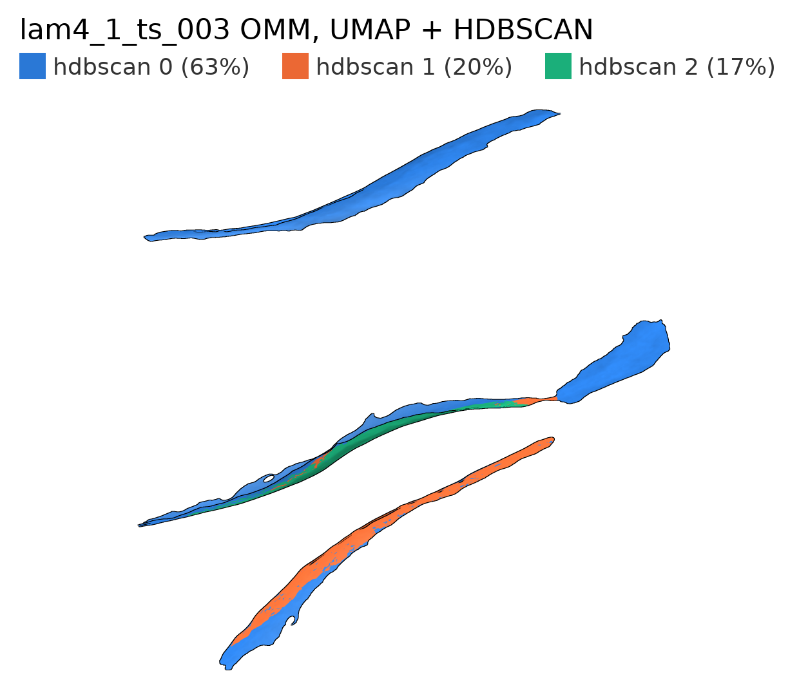
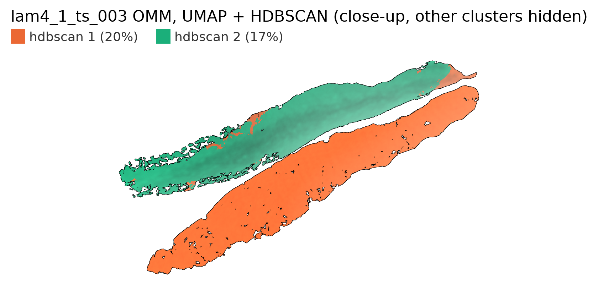

# OMM baseline clustering (PCA + GMM)

YTC041_1, 24 OMM surfaces. Same pipeline and checks as the IMM (`2026-10-02_IMM_baseline_gmm.md`).

## Results

- **No robust clustering.** The most stable k changes with every smoothing level and feature set, and geometry-only clusters barely agree across smoothing levels.
- **No two-group split like the IMM.** The OMM sits about 13 nm from the IMM almost everywhere.
- **The one distinct cluster is surface-specific.** It covers about 2% of triangles, and 42% and 36% of it come from just two surfaces (`lam4_1_ts_003`, `lam18_ts_004`). It's OMM whose normal ray hits another OMM about 100 nm away (no hit = 400 nm elsewhere). It disappears when the self-distance features are dropped.
- **Clusters still form patches on the mesh:** they beat the smoothing-only null on all 24 surfaces in every run.

## Choosing k

Most stable k (ARI mean / worst across 5 seeds):

| Features | sigma 0 | sigma 2 | sigma 5 |
|---|---|---|---|
| All | 8 (0.94 / 0.87) | 5 (0.90 / 0.83) | 7 (0.89 / 0.86) |
| No flags | 8 (0.95 / 0.94) | 4 (0.94 / 0.87) | 4 (0.78 / 0.61) |
| Geometry | 8 (0.78 / 0.70) | 7 (0.73 / 0.63) | 3 (0.81 / 0.64) |

Agreement across smoothing levels (ARI) is 0.19–0.36 with geometry-only features at k = 3–4, and 0.29–0.81 with all features.

## On the mesh (sigma 5, all features, k = 7)

Per surface: an overview from above, then a close-up (the c3 facing sheet on `lam4_1_ts_003`; a face-on wall view on the other two).

On `lam4_1_ts_003`, c3 (yellow) is the face of an OMM sheet that runs alongside another sheet:

## UMAP + HDBSCAN comparison

- **One main cluster (96%) and two small ones (about 2% each).** Both small ones come from a handful of surfaces (min 2.7 effective surfaces, up to 45% from one surface).
- On `lam4_1_ts_003`, the small clusters mark the same facing sheets as the GMM's c3.

## Caveats

- Mesh colours use the seed-0 k = 7 fit saved by `select_k.py`. The sweep's own k = 7 fit gave different labels, which is another sign the OMM clustering isn't stable.
